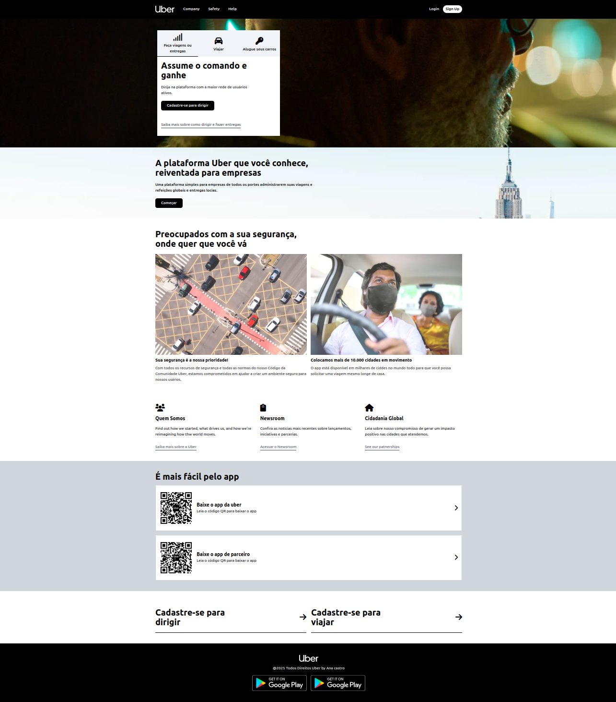

# 🚗 Projeto Frontend - Clone Uber

Este projeto é uma **reprodução visual da interface da página inicial da Uber**, desenvolvida com **HTML5** e **Tailwind CSS**, visando praticar design responsivo e técnicas modernas de estilização com Tailwind.

---

## 🧪 Tecnologias Utilizadas

- HTML5  
- [Tailwind CSS](https://tailwindcss.com/)  
- Visual Studio Code  
- Linux

---

## 📦 Pré-requisitos

Antes de iniciar, certifique-se de ter instalado:

- Node.js e npm
- Git
- VS Code
- Tailwind CSS CLI

---

## 🚀 Como rodar o projeto

### 1. Clone este repositório

git clone https://github.com/seu-usuario/uber-clone.git
cd uber-clone 

### 2. Instale o Tailwind CSS via CLI

npm install -D tailwindcss
npx tailwindcss init

### 3. Configure o Tailwind (tailwind.config.js)

module.exports = {
  content: ["./*.html"],
  theme: { extend: {} },
  plugins: [],
}

### 4. Crie os arquivos CSS

Lembrete: https://tailwindcss.com/ ( conferir a documentação por conta da versão)

Arquivo: output.css

@tailwind base;
@tailwind components;
@tailwind utilities;

### 5. Gerar o CSS final

npx tailwindcss -i ./input.css -o ./output.css --watch

Entrar no arquivo package.json

mudar o script onde está escrito test para dev e colar o comando colado a cima.

### 6. Execute o HTML

Cole no terminal este comando: xdg-open index.html

Ou clique com o botão direito do mouse no arwuivo index.html e use a extensão Live Server no VS Code.

